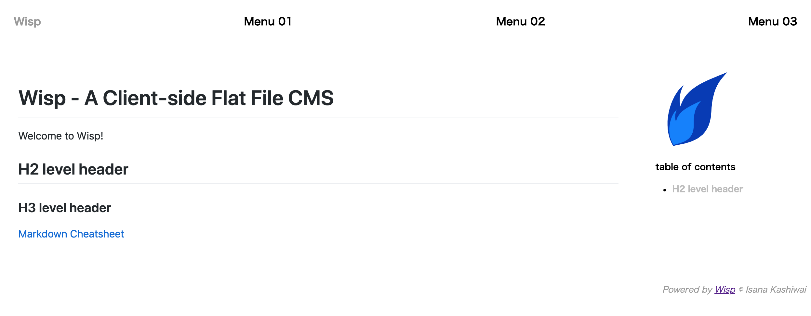
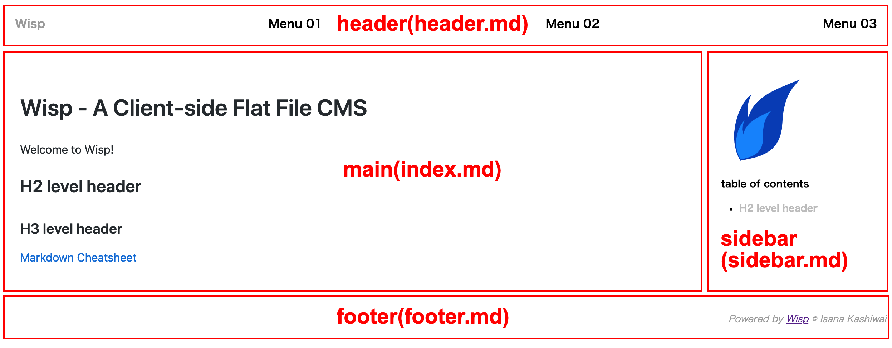

# Getting Started

## WispをWikiとして使う
簡易のWiki/CMSとして使うなら、ライブラリに同包されているindex.htmlがそのまま使えます。準備はライブラリをダウンロードして、解凍して、適当なWebサーバにまるごとアップロードするだけです。

デフォルトのファイル構成は以下のようになっています。

>wisp/
>  index.html   ... 表示用のhtmlファイル
>  header.md    ... ヘッダ部分のMarkdownファイル
>  sidebar.md.    ... サイドバーのMarkdownファイル
>  index.md   ... 本文エリアのMarkdownファイル
>  default.css    ... cssファイル
>  js/
>    wisp.js    ... ライブラリ本体
>    ...

※ `js/` 内にはこれ以外にもプラグインなどのjavascriptファイルが入っています。

このうち、編集が必要なのは3つのMarkdownファイルだけ。見た目に手を入れたくなったら、cssファイルを修正すればたいていは事足りるはずです。システムの本体である`index.html`や`js/`以下のスクリプトを触る必要は、まずありません。

ファイルをサーバにアップロードした状態でブラウザでページを開くとこんな感じ。基本的な構成は、このサイトと同じです。



各エリアのIDと、対応するMarkdownファイルはこんな感じ。



それぞれのエリアにはIDが振られていて、それぞれカッコ内の対応するMarkdownファイルが読み込まれています。このIDとファイルの組み合わせは、URLクエリでのページ更新で重要な役割を果たします。

それぞれのMarkdownファイルの内容は以下の通りです。

### header(header.md)
`header`のエリアに表示されるコンテンツです。`[Wisp](./)`は、相対リンクでサイトのトップディレクトリを指定しています。

```
[Wisp](./)

Menu 01

Menu 02

Menu 03
```

### main(index.md)
`main`のエリアに表示されるコンテンツです。末尾の`[Markdown Cheatsheet](./?main=markdown.md)`に注目してください。これがWispでのサイト内リンクの表記の仕方です。これは、`main`のエリア内に`markdown.md`を読み込むという指定です。

```
# Wisp - A Client-side Flat File CMS

Welcome to Wisp!

## H2 level header

### H3 level header

[Markdown Cheatsheet](./?main=markdown.md)

```

### sidebar(sidebar.md)
`sidebar`のエリアに表示されるコンテンツです。`<div class="toc"></div>`は、目次プラグイン用の指定です。このサイトのサイドメニューに表示されているように、`main`のエリア内の`<h2>`タグを抽出して、ページ内リンクを生成します。

```


**table of contents**

<div class="toc"></div>
```

### footer(footer.md)
`footer`のエリアに表示されるコンテンツです。ここでは、外部リンクとして、WispのGitHubリポジトリが指定されています。

```
Powered by [Wisp](https://github.com/lizard-isana/wisp/) &copy; Isana Kashiwai

```

## サイト内リンク
上でも少し触れましたが、Wispでのサイト内リンクは`index.html`に対するURLクエリとして、 `id=ファイル1,ファイル2...`という形で指定します。

`main`に`markdown.md`を表示するなら、こんな感じ。`<a>`タグのリンク指定(`href=`)の中に相対パスを書くときと同じです。

```
[Markdown Cheatsheet](index.html?main=markdown.md)
```

ご存知の通り、index.htmlは省略できるので。以下のように書いても同じです。

```
[Markdown Cheatsheet](?main=markdown.md)
```
個人的には、カレントディレクトリを明示する以下の書き方が好きです（このサイトはそうなっています）。

```
[Markdown Cheatsheet](./?main=markdown.md)
```

試してみましょう（ブラウザの戻るボタンか、ヘッダのBasicsをクリックすればこのページに戻ります）。

[Markdown Cheatsheet](./?main=markdown.md)

ただし、下のように書くと、`markdown.md`そのものにリンクが張られてしまうので注意してください。この場合は、Markdownはレンダリングされず、markdown.mdファイルそのものが見えます。

```
[markdown.md](markdown.md)
```

[markdown.md](markdown.md)

### 複数ファイル指定
markdownファイルは複数指定できます。以下の例では、`main`に`index.md`と`basics.md`を結合して表示します。

```
[Index & Basics](./?main=index.md,basics.md)

```
[Index & Basics](./?main=index.md,basics.md)

### `main` 以外の領域の指定

main以外の領域を指定することもできます。以下の例では、`main`に`index.md`と`basics.md`を読み込み、`header`に`footer.md`を、`sidebar`に`header.md`を指定して読み込んでいます。逆に、`footer`は何も指定していないので、デフォルトの状態が継承されています。

```
[Index & Basics with header & sidebar replaced](./?main=index.md,basics.md&header=footer.md&sidebar=header.md)

```
[Index & Basics with header & sidebar replaced](./?main=index.md,basics.md&header=footer.md&sidebar=header.md)

ちょっとややこしいですが、何が起きているかわかりますか？

## データファイルの置き場所
デフォルトでは、データファイルはindex.htmlと同じ場所に置くように設定されています。URLクエリで別ディレクトリを指定しても無視されます。

```
index.html?main=./data/index.md
```
上のように指定しても、以下の指定と同じものとして処理します（これができてしまうと、セキュリティ上のリスクがあるためです）。

```
index.html?main=index.md
```
ファイルを別の場所に置きたい場合は、index.htmlの修正が必要です。

たとえば、`./data/`以下にファイルを置きたい場合は、index.htmlの以下の4か所を

```
header.load("header.md");
...
main.load("index.md");
...
sidebar.load("sidebar.md");
...
footer.load("footer.md");
```
それぞれ以下のように修正します。

```
header.load("./data/header.md");
...
main.load("./data/index.md");
...
sidebar.load("./data/sidebar.md");
...
footer.load("./data/footer.md");
```

こうすると、たとえば`./?main=basics.md`の指定で`/data/basics.md`を探しに行くようになります。

ここで何をやっているかについては、[Advanced Usage](./?main=advanced.md)を合わせて参照してください。
